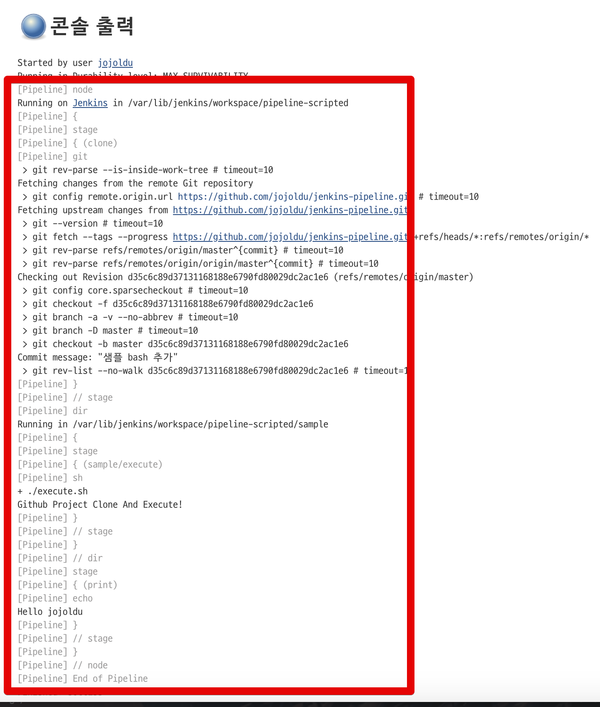
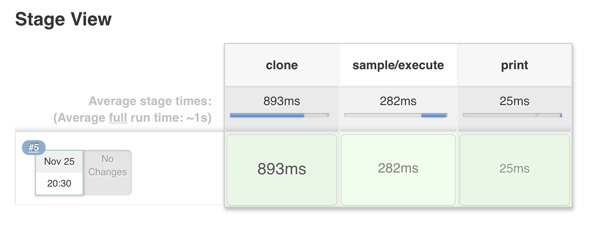

# 2. Scripted 문법

이번 시간에는 젠킨스 파이프라인의 Scripted 문법을 소개드리겠습니다.  
지난 시간에 말씀드린 것처럼 Scripted 문법은 쉘 스크립트를 짜듯이 **자유롭게 파이프라인을 구성**할 수 있도록 지원합니다. Scripted 문법은 **Groovy 문법**을 사용합니다.  
Groovy를 안써보신 분들이더라도 Java나 기타 다른 언어를 써보셨다면 쉽게 이해하실 수 있으시니 걱정하지 않으셔도 됩니다.  
  
2개의 문법이 있다는 것은 서로 사용해야할 때가 다른다는 의미겠죠?  
여기서는 정확히 어떤 때에 2개의 문법을 선택해서 써야하는지 말씀드릴수는 없습니다.  
다만, 이 시리즈에서는 서로의 장점과 단점을 소개해드리겠습니다.  
장단점을 보시고 본인의 상황에 맞게 선택해서 쓰시면 될 것 같습니다.

## 2-1. 장점과 단점

Scripted 문법의 장점과 단점은 다음과 같습니다.

### 장점

* 더 많은 절차적인 코드를 작성 가능
* 프로그램 작성과 흡사
* 기존 파이프 라인 문법이라 친숙하고 이전 버전과 호환 가능
* 필요한 경우 커스텀한 작업 생성이 가능하기 때문에 유연성 좋음
* 보다 복잡한 워크 플로우 및 파이프 라인 모델링 가능

### 단점

* 일반적으로 더 많은 프로그래밍이 필요합니다.
* Groovy 언어 및 환경으로 제한된 구문 검사
* 전통적인 젠킨스 모델과는 맞지 않습니다
* **Declarative 문법으로 쉽게 수행 할 수 있다면 동일한 워크 플로에 대해 잠재적으로 더 복잡**합니다.


## 2-2. 사용법

Scripted 문법에는 별도의 기능을 지원하는 Directive (지시어 정도로 이해해주세요.)가 있습니다.  
아래는 대표적인 Directive들 입니다.

| Directive   |  설명   |
|  ---  |  ---  |
|  ```node```     |  Scripted 파이프라인을 실행하는 젠킨스 에이전트 <br> 최상단 선언 필요 <br> 젠킨스 마스터-슬레이브 구조에서는 파라미터로 마스터-슬레이브 정의     |
|  ```dir```     |  명령을 수행할 디렉토리 / 폴더 정의     |
|  ```stage```     |  파이프라인의 각 단계를 얘기하며, 이 단계에서 어떤 작업을 실행할지 선언하는 곳<br>(즉, 작업의 본문)     |
|   ```git```    | Git 원격 저장소에서 프로젝트 Clone    |
|  ```sh```     | Unix 환경에서 실행할 명령어 실행<br>윈도우에서는 ```bat```    |
|  ```def```     | Groovy 변수 혹은 함수 선언<br>Javascript의 ```var```같은 존재로 이해   |

> 위에서 나온 지시어들은 모두 Scripted 문법입니다.  
즉, Declarative 문법에서는 사용할 수 없습니다.

위에서 언급한 Directive를 통해 다음과 같은 포맷으로 스크립트를 작성할 수 있습니다.

```groovy
// Scripted Pipeline
node('worker') {
    stage('Source') { // 스테이지 정의
        // 스테이지에서 수행할 코드 작성
```

Scripted 파이프라인을 쓴다고 하면 ```node```는 **필수로 선언**하셔야 합니다.  
node가 선언되었다면 이후 성격에 맞게 ```stage```를 정의해서 사용하시면 됩니다.

## 2-3. 만들어보기

자 그럼 위에서 설명한 Directive로 샘플 스크립트를 작성해보겠습니다.  
파이프라인 Item을 새로 만드시고 아래와 같이 코드를 작성해봅니다.


```groovy
node {
    def hello = 'Hello jojoldu' // 변수선언
    stage ('clone') {
        git 'https://github.com/jojoldu/jenkins-pipeline.git' // git clone
    }
    dir ('sample') { // clone 받은 프로젝트 안의 sample 디렉토리에서 stage 실행
        stage ('sample/execute') {
            sh './execute.sh'
        }
    }
    stage ('print') {
        print(hello) // 함수 + 변수 사용
    }
}

// 함수 선언 (반환 타입이 없기 때문에 void로 선언, 있다면 def로 선언하면 됨)
void print(message) {
    echo "${message}"
}
```

* ```def```로 ```hello``` 변수를 선언했습니다.
* ```stage```에서는 ```clone, sample, print```라는 작업을 선언했습니다.
* ```dir```로 
* 

위 코드를 복사해서 실행해보시면 아래처럼 정상적으로 스크립트가 시작되는 것을 확인할 수 있습니다.





## 참고

좀 더 자세한 설명을 원하시면 [공식 문서 - scripted-pipeline](https://jenkins.io/doc/book/pipeline/syntax/#scripted-pipeline) 을 참고해보세요
