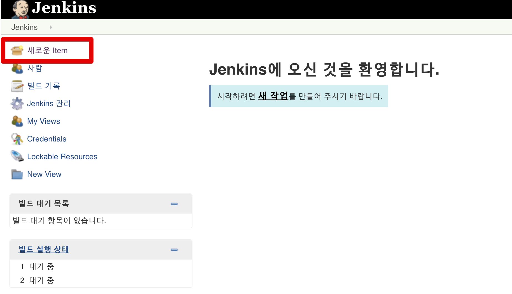
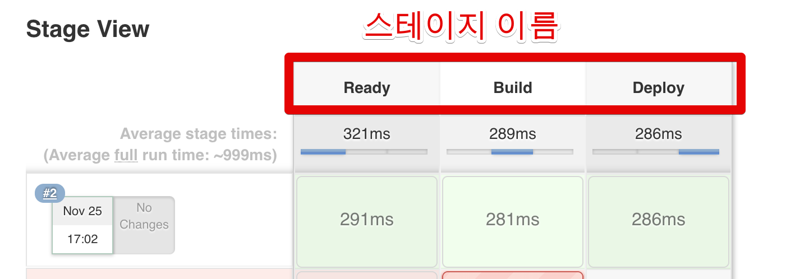
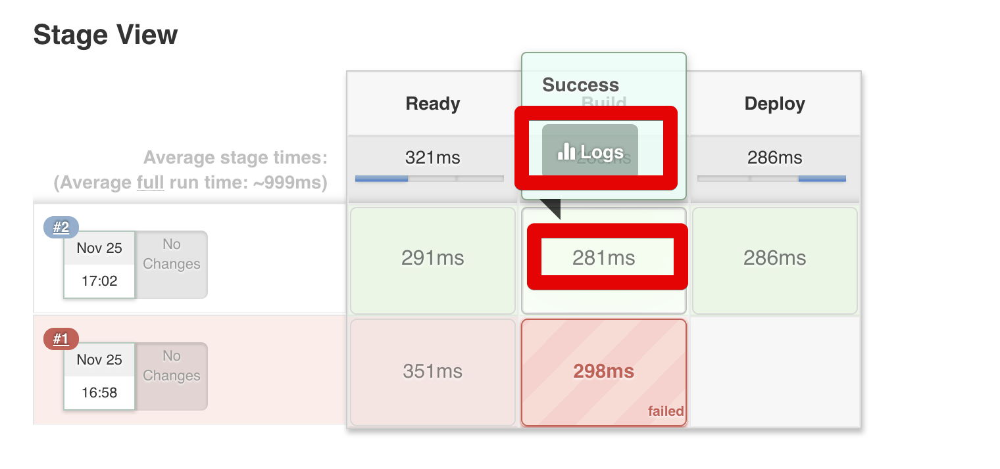

# 젠킨스 파이프라인 정리

안녕하세요? 이번 시간엔 젠킨스 파이프라인을 정리해보려고 합니다.  
모든 코드는 [Github](https://github.com/jojoldu/blog-code/tree/master/jenkins-pipeline)에 있기 때문에 함께 보시면 더 이해하기 쉬우실 것 같습니다.  
(공부한 내용을 정리하는 [Github](https://github.com/jojoldu/blog-code)와 세미나+책 후기를 정리하는 [Github](https://github.com/jojoldu/review), 이 모든 내용을 담고 있는 [블로그](http://jojoldu.tistory.com/)가 있습니다. )<br/>


## 1. 파이프라인 샘플 만들어보기




```bash
node {
    stage('Ready') {
        sh "echo 'Ready'"
    }
    
    stage('Build') {
        sh "echo 'Build Jar'"
    }
    
    stage('Deploy') {
        sh "echo 'Deply AWS'"
    }
}
```







## 2. Scripted 문법

파이프 라인 구문은 선언적 및 스크립팅의 두 가지 형식으로 나타낼 수 있습니다 . 선언적 구문은 파이프 라인을 작성하는 간단하고 논쟁적인 방법입니다. 스크립팅 된 파이프 라인은 Groovy로 빌드되며 일반적으로 파이프 라인을 생성하는 데보다 유연하고 표현적인 방법입니다.
선언적 모델은 단순한 파이프 라인과 함께 작동하며 스크립트 모델에서 제공하는 대부분의 유연성이 부족합니다.  
이 두 가지 구문은 서로 다르며 호환되지 않습니다. 따라서 문서를 보는 동안 스크립팅 된 파이프 라인을 사용하는 동안 선언 구문을 사용하지 않도록주의해야하며 그 반대의 경우도 마찬가지입니다.


	

| 지령   |  설명   |
|  ---  |  ---  |
|  ```node```     |  Scripted 파이프라인을 실행할 젠킨스 에이전트 <br> 최상단 선언 필요 <br> 젠킨스 마스터-슬레이브 구조에서는 파라미터로 마스터-슬레이브 정의     |
|  ```dir```     |  지시어를 실행할 디렉토리 / 폴더 정의     |
|  ```stage```     |  파이프라인의 각 단계를 얘기하며, 이 단계에서 어떤 작업을 실행할지 선언하는 곳<br> (즉, 작업의 본문)     |
|   ```git```    | Git 원격 저장소에서 프로젝트 Clone    |
|  ```sh```     | Unix 환경에서 실행할 명령어 실행<br>윈도우에서는 ```bat```    |
|  ```def```     | Groovy 변수 혹은 함수 선언   |


예를 들어서 다음과 같이 Scripted 파이프라인을 생성할 수 있습니다.


```groovy
node {
    def hello = 'Hello jojoldu' // 변수선언
    stage ('clone') {
        git 'https://github.com/jojoldu/jenkins-pipeline.git' // git clone
    }
    dir ('sample') { // clone 받은 프로젝트 안의 sample 디렉토리에서 stage 실행
        stage ('sample/execute') {
            sh './execute.sh'
        }
    }
    stage ('print') {
        print(hello) // 함수 + 변수 사용
    }
}

// 함수 선언 (반환 타입이 없기 때문에 void로 선언, 있다면 def로 선언하면됨)
void print(message) {
    echo "${message}"
}
```

좀 더 자세한 설명을 원하시면 [공식 문서 - scripted-pipeline](https://jenkins.io/doc/book/pipeline/syntax/#scripted-pipeline) 을 참고해보세요

## 3. Declarative 문법


좀 더 자세한 설명을 원하시면 [공식 문서 - declarative-pipeline](https://jenkins.io/doc/book/pipeline/syntax/#declarative-pipeline) 을 참고해보세요

## 4. Jenkins Job들 순차 실행

## 5. Jenkins Job들 병렬 실행
 
## 6. Exception 발생시 Slack 알람 발송하기

## 7. 
## 참고

* [공식 문서 - Pipeline Syntax](https://jenkins.io/doc/book/pipeline/syntax/)

* [how-to-use-the-jenkins-scripted-pipeline)](https://www.blazemeter.com/blog/how-to-use-the-jenkins-scripted-pipeline)